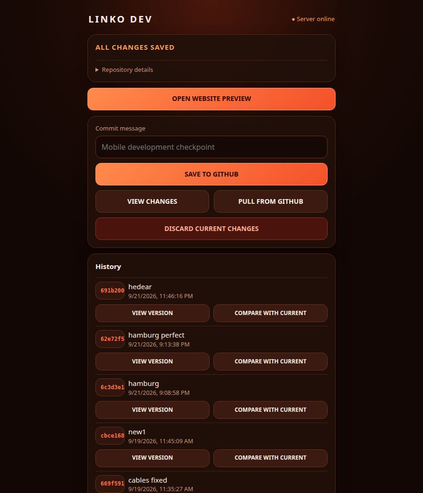
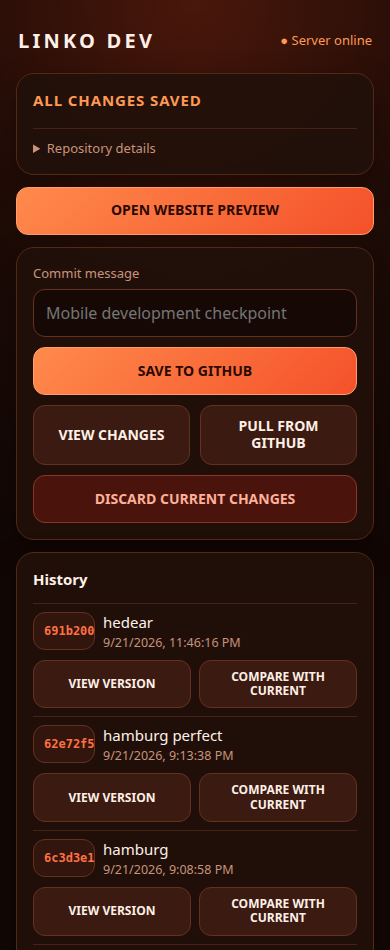

# Linko Dev Panel

A small, private web panel for the Linko website. It shows Git status,
previews the current website, reviews diffs, commits and pushes changes, pulls
fast-forward updates, and browses and compares earlier commits. It uses only the
Python standard library.

The panel operates on the separate Linko website repository at
`/home/mint1/projects/Linko`. That path is currently set in `server.py`; edit
`REPO` there if the website lives elsewhere. This repository contains the panel,
not a copy of the website.

## Screenshots

These screenshots show the panel UI with a captured Git status response. They
were rendered from the project HTML without starting the HTTP server.

| Desktop | Mobile |
| --- | --- |
|  |  |

## Requirements

- Python 3.10 or newer and Git
- A checked-out Linko website Git repository at the `REPO` path in `server.py`
- GitHub access for that website repository if using Save to GitHub or Pull

## Run locally

```bash
LINKO_PANEL_HOST=127.0.0.1 ./start.sh
```

Open <http://127.0.0.1:8765/>. Run this from the `dev-panel` directory. The
panel is also available at `/panel` and `/dev-panel`; `/preview` opens the
current website preview at `/preview/xsecret.html`.

On the original Mint machine, `./start.sh` binds to its configured Tailscale
address, `100.65.36.48`, by default. Open `http://100.65.36.48:8765` from an
authorized device on the same tailnet. Change `LINKO_PANEL_HOST` if its
Tailscale address changes.

Historical previews use committed files and do not change the working tree or
current browser tab. Entering or leaving historical mode requires a clean
working tree. The panel never automatically commits, stashes, or discards work.

The Save action commits and pushes changes in the **Linko website repository**,
not in this panel repository. Check its remote and Git credentials before using
that action.

## Configuration

- `LINKO_PANEL_HOST`: bind address (default `100.65.36.48`)
- `LINKO_PANEL_PORT`: port (default `8765`)
- `LINKO_PANEL_ALLOWED_HOSTS`: optional comma-separated extra HTTP hostnames,
  useful for a Tailscale MagicDNS name

## Optional systemd user service

The included service is only a template; it is not installed or enabled. Edit
its `WorkingDirectory` and `ExecStart` paths if you cloned this repository to a
different location.

```bash
mkdir -p ~/.config/systemd/user
cp /home/mint1/projects/dev-panel/linko-dev-panel.service ~/.config/systemd/user/
systemctl --user daemon-reload
systemctl --user enable --now linko-dev-panel.service
```

Check it with `systemctl --user status linko-dev-panel.service`. To start it
at boot even before interactive login, user lingering may need to be enabled by
an administrator (`sudo loginctl enable-linger "$USER"`).

## Access and safety

The server has no arbitrary-command endpoint. Git subprocesses use fixed
argument arrays and the fixed `/home/mint1/projects/Linko` repository directory.
Commit IDs are restricted to hexadecimal Git hashes and resolved as commit
objects before use. Mutating requests require a per-process CSRF token; save and
discard also require a short-lived review token.

There is no login screen or TLS. Anyone who can reach this port over the
Tailscale network can view the repository preview and use the controls. Use
Tailscale ACLs/grants and the host firewall to restrict access further if your
tailnet includes people or devices you do not fully trust.
